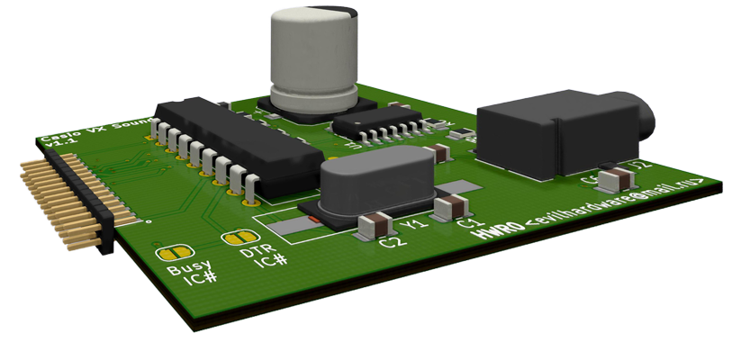

# Original Soundcard Designs

Following Soundcard designs were found on the Internet Archive (Miyura, 2010)
and put into KiCAD by yours truly with very little modifications.

<a href="CASIO%20PB-1000%20YM2413%20Soundcard/">OPLL Soundcard for Casio PB-1000</a>

<a href="CASIO%20VX4%20YM2413%20Soundcard%20v1.1/">OPLL Soundcard for Casio VX-3,4,Z-1</a>

Footprints for RLC are 0805 (except for the one big capacitor). 
Integrated circuits are in DIP or SOIC footprint, to be more kind to people without killer solder skills. 
All components except the YM2413B can be sourced from LCSC.com. I bought my YM2413Bs on Ebay 
**Make sure that PCBs are fabricated in 0.8mm thickness, otherwise you couldn't fit the PCB in the 2x15 1.27mm Casio Interface Connector** 

__**Positive points:**__ 
- elegant and simple design
- no extra power supply needed

__**Negative Points:**__
- YM2413B Chip directly connected to Casio System Bus without buffer (f... dangerous!)
- no extra power supply (will consume the Casio Batteries quite nicely IMHO)
- minimal Code Examples were provided for PB-1000 **but not for VX-4** (so figure it out yourself)

I will rework the designs as soon as I validate these (I'll order the PCBs after Chinese New Year)
