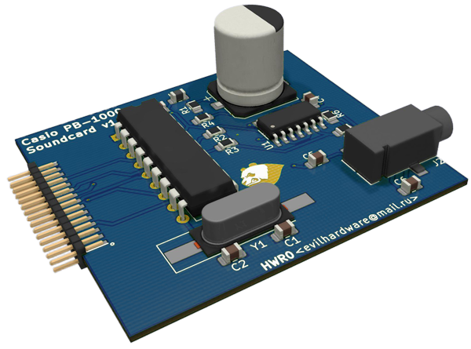

# PokeConSound
OPL / OPLL* / SID Soundcard Designs for Pocket Computers (ポケコン) (Sharp, Casio, TRS80-M100,...)

<a href="Orig.Designs/">Original Designs I modeled in KiCAD that gave the inspiration</a>

As soon as the function of the original designs is validated (waiting for the Chinese New Year to finish to order the boards..), 
I will rework the designs to add buffering, power supply, a stereo system, bigger chips, you name it !
